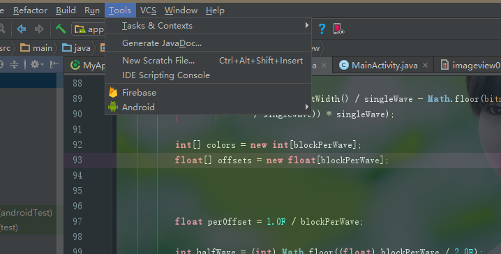
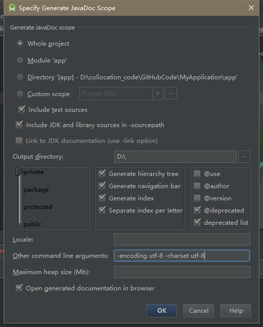

# 如何生成API文档  

1. 打开Tools–>GenerateJavaDoc  

2. 点击Generate javaDoc后我们进入的界面是  
  

这里需要注意的是：

Output directory是指定输出API的目录位置  
需要主要在 Other command line argments:  
这里需要注意的一点是如果你的编码格式为UTF-8的话需要加入以下这句  
 -encoding utf-8 -charset utf-8   
这样不会编译时后报错。   
点击Ok后，会在指定的目录生成API的文档，是以html格式展示，可以点击index进入网页查看。